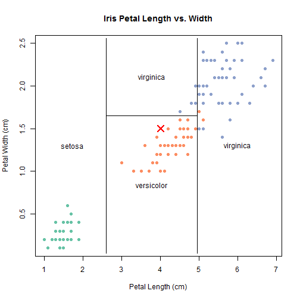

## Introduction

The purpose of this application is to predict the species of an iris flower given a new flower's petal height and petal width. 

This application uses a decision-tree classifier to make predictions. A decision-tree classifier is a type of machine learning algorithm that models a decision-making process as a tree of sub-decisions leading to the final decision. 

The classifier is trained using data from Fisher's Iris data set. The data set contain petal and sepal height and width data collected from 150 Iris flowers (i.e. 50 iris setosa, 50 iris virginica, and 50 iris versicolor).

---

## Instructions

To predict a species of iris flower, please select the petal length and the petal width using the two sliders.

The predicted species will be displayed in the text on the top right. In addition, a data visualization in the bottom right will show how the decision was made. The lines represent the decision boundaries and the red X represents your selected input.

---

## Prediction Algorithm

The machine learning algorithm is trained using the following code.


```r
data(iris)

set.seed(42)

indexes <- sample(
  x = 1:150, 
  size = 100)

train <<- iris[indexes, ]

test <- iris[-indexes, ]

treeModel <- tree(
  formula = Species ~ .,
  data = train)
```

---

## Data Visualization

A data visualization is created to help you understand how the prediction was made.




